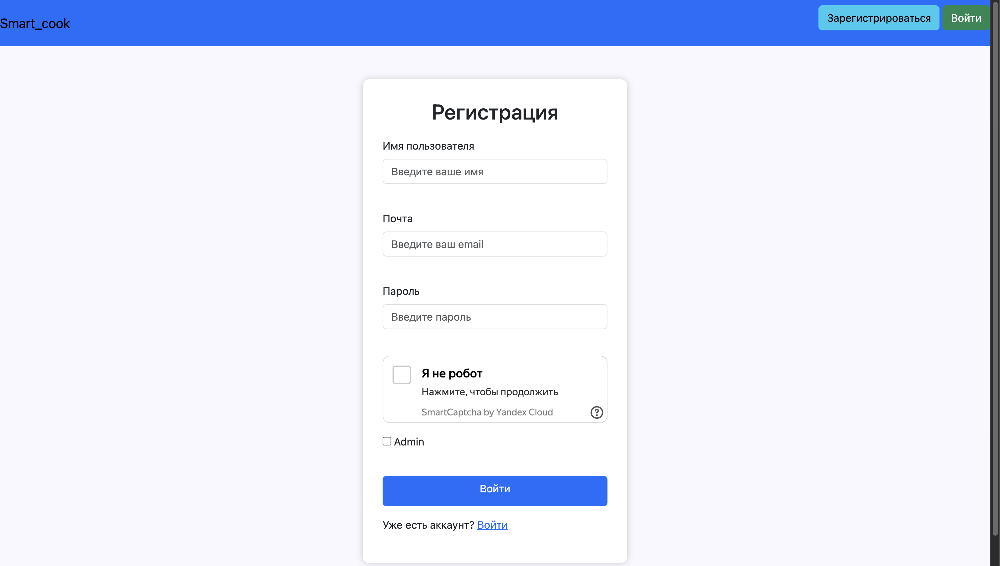
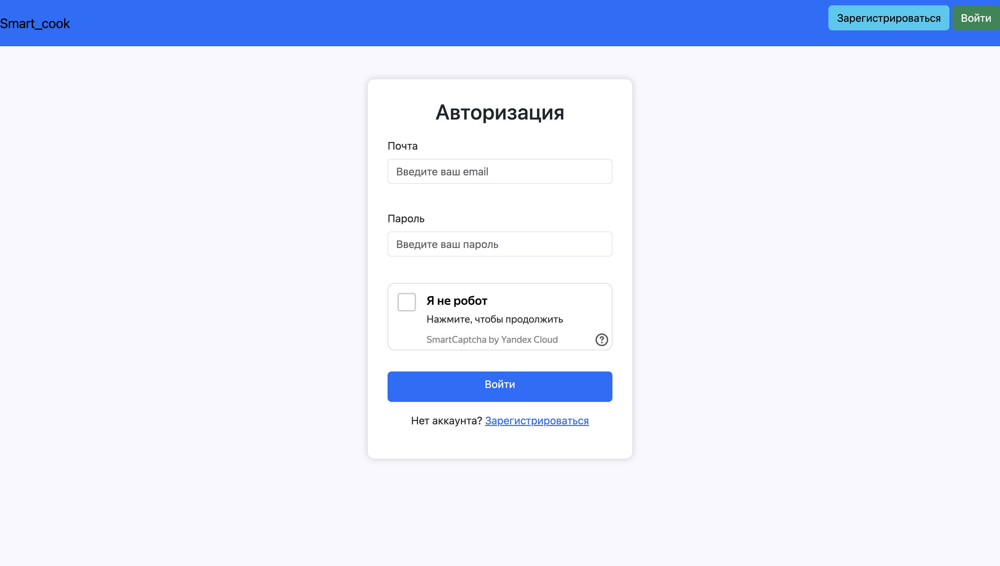
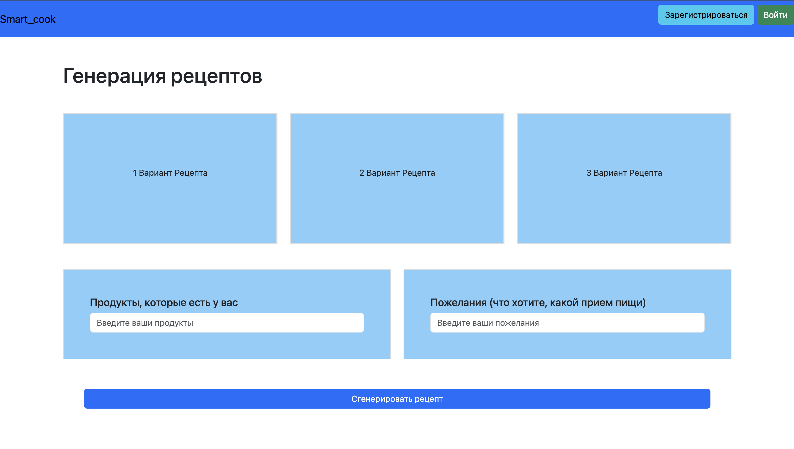

### 1. О проекте

#### a. Название и назначение проекта
- **Название проекта**: Smart_cook
- **Назначение**: Создать сайт, который поможет подобрать рецепт еды, исходя из ваших пожеланий и продуктов

#### b. Информация об авторах
- **Тимлид**: Будыгин Тимофей, https://github.com/tvbudygin
- **Разработчики**: Будыгин Тимофей, https://github.com/tvbudygin
- **Учитель**: Алексей Владимирович, https://github.com/anatolyev

#### c. Количество строк кода проекта
- Примерное количество строк кода: **пока не знаю строк**.

#### d. Ссылка на техническое задание
[Техническое задание](materials/technical_specification.md)

### 2. Процесс установки библиотек
- **В терминале написать:   pip install --user -r requirements.txt**

### 3. Администрирование проекта
| Действия пользователя    | Действия администратора и программиста                                            |
|--------------------------|-----------------------------------------------------------------------------------|
| Авторизация              | Появление нового значения в бд                                                    |
| Получение нового рецепта | Отображение пользователя, количества запросов и самих запросов, новые данные в бд |
| Лайк рецепта             | Новые данные в бд                                                                 |
| Удаление профиля         | Изменения в бд                                                                    |

### 4. Управление для пользователя
- **Так выглядит регистрация, куда нужно ввести почту, пароль, имя, пройти капчу:**
  
- **Так выглядит логин:**
  
- **Так выглядит профиль человека, где видна история запросов, имя, почта, дата создания, возможность удалить аккаунт и понравившееся рецепты:**
  
- **Так выглядит основная страница сайта, на которой вы можете загрузить свои продукты и пожелания, после этого получите ифнормацию о том, что можно приготовить, и поставить лайк на то, что понравилось**
  

### 5. Скринкаст

